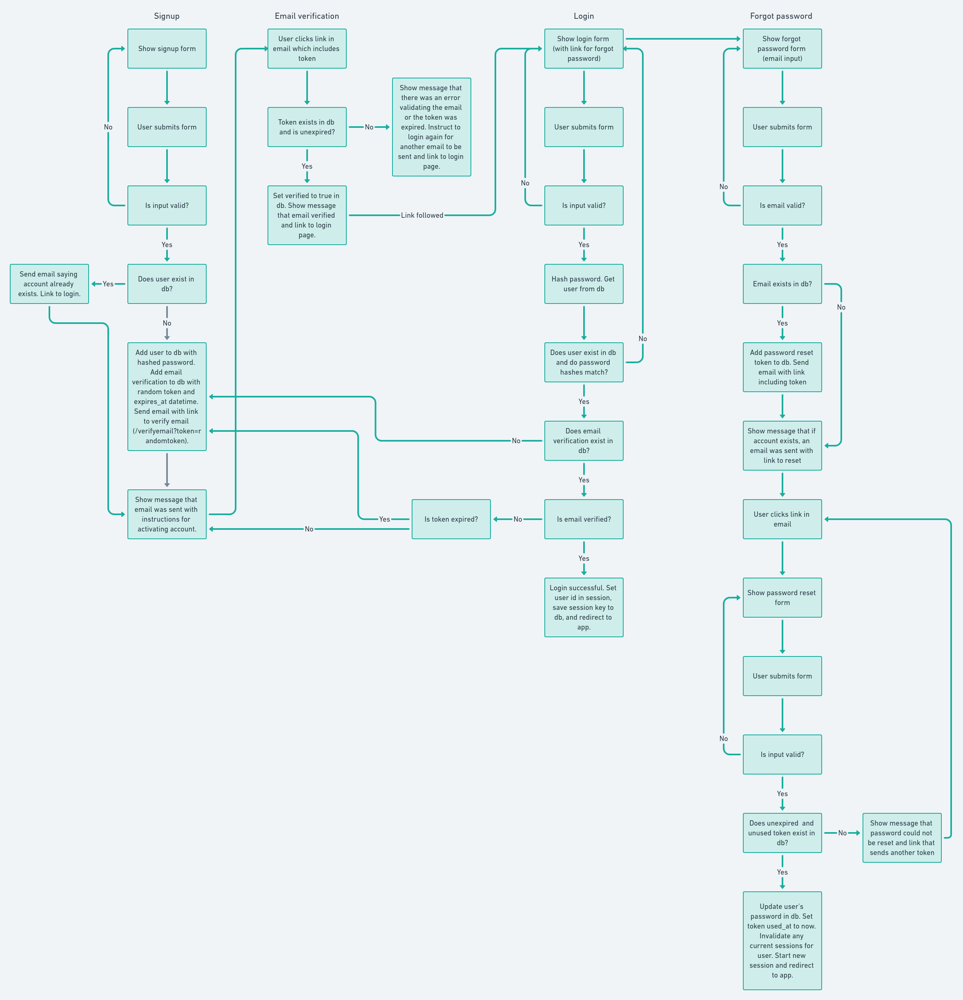
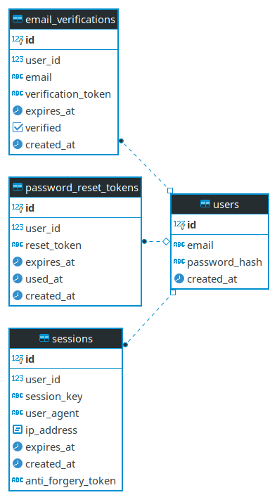

# Auth Template

This is a template for a project that uses session-based authentication. It can provide a good starting point for a web app with authentication and a pedestal backend. I figure this repo can serve as a reference for myself later, and maybe others will find it useful too.

The database layer uses postgresql, but this can be switched out if desired.

Feel free to copy and use this template however you want. You'll probably want to replace `auth-template` throughout the project with your project name.

I used some security recommendations from owasp.org in the design of this template app, but I do not claim to be a security expert by any means, and things will likely need to be customized per app. See the [references](#references) section for more information.

The main structure of the app is that all non-authenticated auth pages are standard html pages. When the user is logged in, and html page is loaded that will host a single-page application. This SPA aspect can be done away with easily if desired.

## Features

* user sign up with email address
* email verification via link with token emailed to user
* user login
* user logout
* forgot password / password reset

## Tooling

* clojure cli
* pedestal for the backend service
* java-time for handling time and dates
* postal for sending emails
* yogthos/config for configuration
* next.jdbc for database interaction
* hiccup for rendering html
* buddy-hashers for hashing passwords and checking raw passwords against stored hashes
* hikaricp for database connection pooling
* docker for packaging and deployment
* shadow-cljs for clojurescript compilation

## Auth Flow

## Data Model

> “Show me your flowcharts and conceal your tables, and I shall continue to be mystified. Show me your tables, and I won’t usually need your flowcharts; they’ll be obvious” – Fred Brooks, author Mythical Man-Month

See the `database-ddl.sql` file for the SQL to create this model in PostgreSQL.

## Development

### Configuration

Create a `dev-config.edn` file and fill out the required config values. See the `auth-template.config` namespace and the `dev-config-example.edn` file for more details.

### Server

Start a REPL, load the `auth-template.server` namespace, and evaluate `(start-dev)`. This will start a development server with development interceptors for showing errors, etc. You'll need to have the proper config values set in the `dev-config.edn`, including database connection details. You'll also need the correct [schema](#data-model) set up in the database.

### UI

Start the development server as noted above, then in a new terminal, run `shadow-cljs watch app`, which builds the CLJS into a JS file that is linked in the app HTML, which is served by the server. Changes to cljs files will cause a rebuild of the JS.

## Deployment

Run the `deploy.sh` script (needs to be customized), which automatically builds, tags, and pushes the docker image to the online registry, logs into the remote production server, pulls the latest version of the image, then runs it.

You'll need to have ssh keys set up for logging into the remote server.

You'll also need a config file similar to the `dev-config.edn` file located on your remote server, at the path designated by `PROD_CONFIG_DIRECTORY` in `deploy.sh`.

## References

* https://cheatsheetseries.owasp.org/cheatsheets/Session_Management_Cheat_Sheet.html
* https://cheatsheetseries.owasp.org/cheatsheets/Forgot_Password_Cheat_Sheet.html
* https://cheatsheetseries.owasp.org/cheatsheets/Authentication_Cheat_Sheet.html
* https://cheatsheetseries.owasp.org/cheatsheets/Cross-Site_Request_Forgery_Prevention_Cheat_Sheet.html
